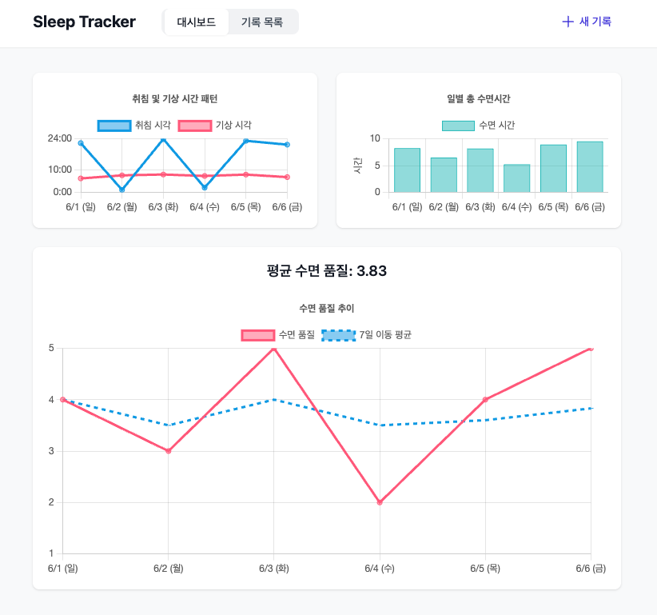
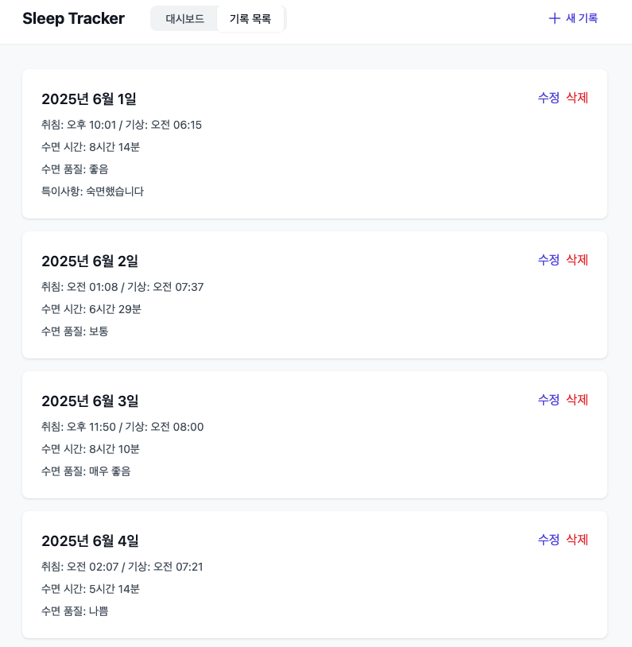
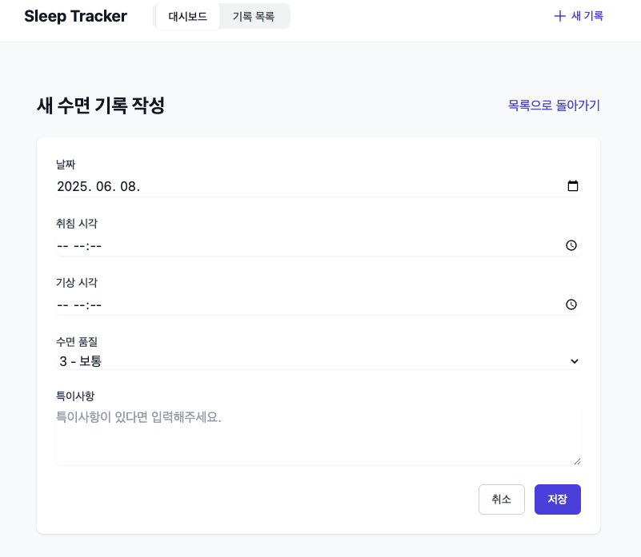

# 수면 트래커

일상의 수면 패턴을 기록하고 분석할 수 있는 웹 기반 수면 트래킹 서비스입니다.
사용자는 매일의 수면 시간과 품질을 기록하고, 직관적인 차트를 통해 수면 패턴을 분석할 수 있습니다.

## 0. 주요 페이지





## 1. 주요 기능

### 1.1 수면 기록 관리

- 날짜별 수면 시간(취침/기상) 기록
- 수면 품질 평가(1-5점)
- 특이사항 메모 기능
- 기록 수정 및 삭제

### 1.2 수면 패턴 분석

- 취침/기상 시간 패턴 차트
- 일별 수면 시간 차트
- 수면 품질 추이 및 7일 이동평균 차트

## 2. 기술 스택

### 2.1 프론트엔드

- **핵심**: React, TypeScript, Vite
- **라우팅**: React Router v6
- **상태관리**: React Query v5
- **스타일링**: TailwindCSS
- **차트**: Chart.js, react-chartjs-2
- **HTTP 클라이언트**: Axios
- **날짜/시간**: date-fns

### 2.2 백엔드

- **런타임**: Node.js
- **프레임워크**: Express
- **데이터베이스**: SQLite
- **ORM**: Prisma
- **API**: RESTful API

## 3. 프로젝트 구조

### 3.1 클라이언트 구조

```
client/
├── src/
│   ├── components/
│   │   ├── charts/           # 차트 컴포넌트
│   │   ├── layout/           # 레이아웃 컴포넌트
│   │   └── sleep/           # 수면 기록 관련 컴포넌트
│   ├── pages/               # 페이지 컴포넌트
│   ├── services/            # API 서비스
│   └── types/              # 타입 정의
├── package.json
└── vite.config.ts
```

### 3.2 주요 컴포넌트

- **Layout**: 전체 레이아웃 및 네비게이션
- **ChartDashboard**: 수면 분석 차트 대시보드
- **SleepEntryList**: 수면 기록 목록
- **SleepEntryForm**: 수면 기록 입력/수정 폼

## 4. API 구조

### 4.1 엔드포인트

```typescript
// 수면 기록 관리 API
GET    /api/sleep-entries     // 전체 수면 기록 조회
POST   /api/sleep-entries     // 새 수면 기록 생성
GET    /api/sleep-entries/:id // 특정 수면 기록 조회
PUT    /api/sleep-entries/:id // 수면 기록 수정
DELETE /api/sleep-entries/:id // 수면 기록 삭제
```

### 4.2 데이터 모델

```typescript
interface SleepEntry {
  id: number
  date: string // YYYY-MM-DD
  sleepTime: string // ISO 8601
  wakeTime: string // ISO 8601
  quality: number // 1-5
  note?: string
  createdAt: string // ISO 8601
  updatedAt: string // ISO 8601
}
```

## 5. 주요 기능 구현

### 5.1 차트 구현

- **SleepScheduleChart**: 취침/기상 시간 패턴 시각화
- **SleepDurationChart**: 일별 수면 시간 막대 차트
- **SleepQualityChart**: 수면 품질 추이와 7일 이동평균

### 5.2 상태 관리

- React Query를 사용한 서버 상태 관리
- 낙관적 업데이트를 통한 UX 개선
- 데이터 캐싱 및 자동 갱신

### 5.3 반응형 디자인

- TailwindCSS를 활용한 모바일 퍼스트 디자인
- 다양한 화면 크기 지원
- 직관적인 UI/UX

## 6. 실행 방법

### 6.1 개발 환경 설정

```bash
# 프로젝트 클론
git clone https://github.com/zzin-h/zzin-h-Solvr-Q6.git
cd zzin-h-Solvr-Q6

# 의존성 설치
pnpm install

# 개발 서버 실행
pnpm dev
```

### 6.2 환경 변수

```env
VITE_API_URL=http://localhost:3000
```
